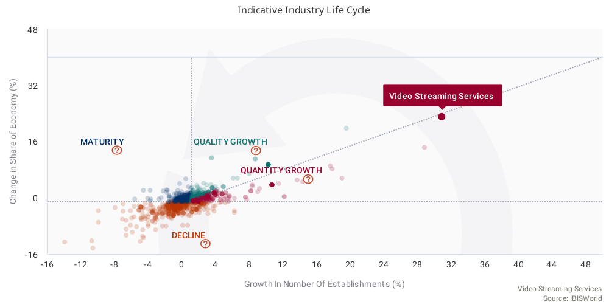

***
# Framing the Problem	
***
## Problem Recognition
***
The on-demand video streaming industry is experiencing exponential growth in recent years and more players are entering the market (Ibis World, 2020). The following analysis looks into the volume of content per platform, the quality, according to ratings and other characteristics as a means to compare the four leading streaming providers' content. As the industry is expected to grow around 20% YoY for the next five years, this competitive analysis aims to shed light on the existing competition and positioning of the players to find a potential niche opening for new entrants.  

***
## Review of Previous Findings	
***


The rapid expansion of this Video Streaming industry is cause for an extensive analysis in factors leading to success in the market.   

***
### Assumptions
***

* While Hulu and Disney+ are both Disney owned companies, their streaming content differs, hence they will be treated individually.
* Due to the fact that the latest release date in the dataset is in January, the following report assumes a data time-stamp of January 2020
* It is assumed that the dataset contains all titles listed/available on the streaming platform (ie. that it is exhaustive)
* Age ratings are “unrated” if NA. 
* TV Shows data did not come with genre. Therefore the NA’s were replaced with TV Show to get some insights from them anyway.   

***
### Research Questions	
***
* Do some platforms host more of a certain genre or type than others?
* Do all platforms have content of the same release years?
* Which platform has the most exclusive content (not available on another platform)?
* Does each streaming platform have a niche in terms of genre, age rating and type of content?
* Do certain streaming platforms host better content than others?
* What role does the streaming platform play on ratings?
* Can Genre, streaming platform and release year be used to estimate a movie’s IMDb rating?  

```{r setup, include=FALSE}
library(tidyverse)
library(tibble)
library(readr)
library(lubridate)

# importing data

# importing movies
data_movies <- read_csv("Hulu_Netflix_IMDB_rottenTomatoes.csv", 
     col_types = cols(x1 = col_skip(), year = col_date(format = "%Y"), imdb = col_number(), `rotten_tomatoes` = col_number(),
         netflix = col_logical(), hulu = col_logical(), 
         `prime_video` = col_logical(), `disney+` = col_logical(), 
         runtime = col_number()))
# importing tv shows
data_tvshows <- read_csv("TVSHOWSHulu_Netflix_IMDB_rottenTomatoes.csv", 
     col_types = cols(X1 = col_skip(), year = col_date(format = "%Y"), 
         imdb = col_number(), `rotten_tomatoes` = col_number(), 
         netflix = col_logical(), hulu = col_logical(), 
         `prime_video` = col_logical(), `disney+` = col_logical(), 
         type = col_logical()))

# converting data to tibbles
data_movies <- tibble(data_movies)
data_tvshows <- tibble(data_tvshows)


# full join on the tv series and movies data
data_movies_tvshows <- data_movies %>% 
  full_join(data_tvshows)


# renaming columns
data_movies_tvshows <- data_movies_tvshows %>% 
  
  #changing column names to prepare for join
  mutate(release_year=year) %>% 
  
  #adjusting imdb to make them comparable to rotten tomato scores scale
  mutate(imdb = imdb*10) %>% 
  mutate(disney = `disney+`) 


# # # # # # # # # # # # # # # # 
# dropping irrelevant ID columns

data_movies_tvshows <- data_movies_tvshows %>% 
  select(-starts_with('id')) %>% #removing id column
  select(-starts_with('x1'))#removing x1 column

# # # # # # # # # # # # # # # # 

#create column tvshow, true when type ==1

data_movies_tvshows<-data_movies_tvshows %>% 
  mutate(tvshow_or_movie = ifelse(type==1,"tvshow","movie"))


# cleaning release_year to be in data format in year column.
data_movies_tvshows<-data_movies_tvshows %>% 
  mutate(release_year = year(year))

#removing mistyped  entries or extreme outliers
data_movies_tvshows<-data_movies_tvshows %>% 
  filter(imdb>5)
#removing runtime <5 and > 250. also retaining values
data_movies_tvshows<-data_movies_tvshows %>% 
  filter(is.na(runtime)|(runtime>5&runtime<250))

data_movies_tvshows<- data_movies_tvshows %>% 
  mutate(genres = ifelse(type == 1, "tvshow",genres)) 


# # # # # # # # # # # # # # # # 
# creating a dataset for exclusive content per streaming platform
# content exclusive to netflix
netflix_exclusive_tibble <- data_movies_tvshows %>% 
  filter(netflix==TRUE & prime_video==FALSE & hulu == FALSE & disney==FALSE)


# content exclusive to disney+
disney_exclusive_tibble <- data_movies_tvshows %>% 
  filter(netflix==FALSE & prime_video==FALSE & hulu == FALSE & disney==TRUE)

# content exclusive to hulu
hulu_exclusive_tibble <- data_movies_tvshows %>% 
  filter(netflix==FALSE & prime_video==FALSE & hulu == TRUE & disney==FALSE)

# content exclusive to prime
prime_video_exclusive_tibble <- data_movies_tvshows %>% 
  filter(netflix==FALSE & prime_video==TRUE & hulu == FALSE & disney==FALSE)

# # # # # # # # # # # # # # # # 
# creating a full join dataset of all exclusive titles. 

complete_exclusive_tibble<-full_join(netflix_exclusive_tibble,hulu_exclusive_tibble)
complete_exclusive_tibble<-full_join(complete_exclusive_tibble,disney_exclusive_tibble)
complete_exclusive_tibble<-full_join(complete_exclusive_tibble,prime_video_exclusive_tibble)

complete_exclusive_tibble %>% 
  filter(type==1) %>% 
  count()
# # # # # # # # # # # # # # # # 

# creating one column with the hosting video platform. 
#complete_exclusive_tibble has only titles that are exclusively available on a streaming service. It has a column 'platform' that has the streaming service of that title. For example, if a title is available on Netflix, the platform column will say Netflix.
complete_exclusive_tibble <- complete_exclusive_tibble %>% 
  mutate(platform = ifelse(netflix == TRUE ,"Netflix","")) %>% 
  mutate(platform = ifelse(hulu == TRUE,"Hulu",platform)) %>% 
  mutate(platform = ifelse(disney == TRUE,"Disney+",platform)) %>%
  mutate(platform = ifelse(prime_video == TRUE,"Prime Video",platform))

# generating a numeric column for age rating 
complete_exclusive_tibble <- complete_exclusive_tibble %>% 
  mutate(age_rating=parse_number(age))

# replacing NA with 'unrated' in the exclusive content tibble. 
complete_exclusive_tibble$age[is.na(complete_exclusive_tibble$age)] <- 'unrated'

# replacing NA for ratings in TV show dataset with genres == "TV_Show"

complete_exclusive_tibble<- complete_exclusive_tibble %>% 
  mutate(genres = ifelse(type == 1, "tvshow",genres)) 


# # # # # # # # # # # # # # # # 
# creating a data subset for titles belonging to exclusively one genre. 
exclusive_genre_tibble <- complete_exclusive_tibble %>% 
  separate(genres, into = c('genre_1', 'genre_2', NA), sep = ",", remove = FALSE, extra = "merge") %>% 
  filter(is.na(genre_2) )


```


***
# Solving the Problem
***
## Variable Selection
***
In order to answer the research questions, the analysis requires information about the content hosted on popular streaming sites, such as ratings, release dates, genre, type of content, and age rating. The main data-set contains data relating to Netflix, Hulu, Disney+ and Prime Video. There are several variables of metadata, as shown in the tibble below.  

```{r Variables,  message = FALSE, warning=FALSE}
variables <- as_tibble(colnames(data_movies_tvshows))

#printing dataset columns and their definitions

# add a column describing the variable
variables$Description <- c("Title of Content", "Release year of content", "Age rating of content", "IMDb rating converted to 1-100", "Rotten Tomatoes Rating (1-100)", "Available on Netflix - Categorical Variable, (1=Yes)","Available on hulu - Categorical Variable, (1=Yes)","Available on prime video - Categorical Variable, (1=Yes)","Available on Disney+ - Categorical Variable, (1=Yes)"," Categorical Variable, (1=TV-Series, 0=Movie)","Names of directors","Listed genres", "Countries of production", "Available languages", "runtime in minutes", "see year", "see disney+", "TV Show = True")
variables %>% 
  rename(Variable="value")#Renaming column names column to variables for readability

```

***
## Data Collection 
***
The data-set that forms the basis of this analysis is a combination of 2 datasets from kaggle.com.  
To extract as much information as possible, some mutations and data cleaning was performed in the set-up chunk above. 
This includes renaming certain columns, changing data from integers to logical and changing the scale of the IMDb rating from 1-10 to 1-100 for better visualizations.  
Furthermore, the data cleaning steps performed led to several subsets, such as a tibble containing only titles that are hosted exclusively on one platform, as well as titles that only belong to only one genre. The exclusive platform dataset will be used for most visualizations in order to compare the platforms on the basis of their exclusive content. Other tibbles will be used for some visualizations to enhance comparison.  
The data in some columns was deemed too complex to extract for the purpose of this analysis. These included language, director and country.  
The genre column was however looked at, and titles that belonged to only one genre were extracted to analyze trends across platforms.  
Outliers, such as movies older than 70 years, and IMDb ratings = 0 were filtered out of the dataset. The same applies to outlier titles with a runtime in minutes below 10 minutes and above 250 minutes.  
Several columns in the dataset include NA values, which were not removed overall, due to the fact that some visualizations were reliant on data in other columns.

***
## Data Analysis
***
### Prime hosts most content by Volume; Hulu's content majority are TV Shows
***
The first steps of this analysis aimed to learn more about the data, the central tendencies, distributions, and counts. Amazon prime has by far the most exclusive titles compared to any other platform. Disney+, as the youngest platform of the comparison, has as expected, the least number of exclusive titles. One possible explanation for the amount of content via prime video is that the service offers some content as part of its subscription and other titles on a pay per view (on-demand) basis, which could skew the analysis in amazon’s favor.  
Overall, it is worth mentioning, that as a proportion, Hulu has more TV shows, while all other platforms host more movies. 


```{r Content Type and Volume by Platform, warning=FALSE}

complete_exclusive_tibble %>%     #plotting movie proportions by streaming platform
  group_by(platform) %>%          #grouping by platform
  count(tvshow_or_movie) %>%      #counting for the y axis
  arrange(desc(n)) %>%             #sorting from highest to lowest
  ggplot(aes(x= platform, y=n))+  #adding titles
  
  #adding a bar plot and dividing it by streaming platform
  geom_bar(aes(fill =tvshow_or_movie), stat = 'identity', position="dodge")+
  #adding title and changing axis labels
  ggtitle("       TV Show : Movie Proportions by Streaming Service") +
  xlab("Streaming Service") + ylab("Number of Titles")+
  scale_fill_manual(name = "Movie or TV Show",values= c('navy','brown'))

```

***
### Netflix: home of the most recent titles by release year
***

The following boxplots revealed that the age of content on the four different platforms varies quite significantly. While prime video content spans the largest range with outliers as old as 100 years, Netflix content is far more concentrated in recent years. This hints at Netflix’s strategy of producing a lot of proprietary content in large volumes in the last 2 years (Business Insider, 2020).  
The content on Hulu is similar in age (release_year) as Netflix, although not quite as concentrated. Disney+s’ content is, as expected nearly evenly distributed around the late nineties to early 2010s, indicating its historically produced content, available on the service.  


```{r Release Year Distribution by Streaming Service, warning=FALSE}
#visualising the spread of the data by platform to see the age of their content

ggplot(data = complete_exclusive_tibble,aes(y = release_year, x = platform, color = platform))+
  
  #adding jitter to have a sense of the number of titles offered by each platform
  geom_jitter(alpha=0.1)+
  geom_boxplot()+
  #correcting colours to match the color schemes of the streaming service logos
  scale_color_manual(name = "Streaming Platform",values= c('navy','springgreen3','red3','darkturquoise'))+
  ggtitle("Release Year Distribution by Streaming Service
+ added jitter layer to show the density of titles") +
  xlab("Streaming Platform") + ylab("Release Year of Content")
```

***
### Genres and platforms
***

The genre column was found to be cluttered with many concatenated genre films/series. Therefore, an analysis looked at only the titles containing a single genre. About 50% of content falls into more than one genre category (ie. “Comedy,Drama”). The other half is primarily made up of dramas and documentaries, closely followed by comedies. The following graph shows the title count per genre and platform in descending order of frequency. An overwhelming majority of titles fall into the dramas and documentaries genre (n= 1245 and n=1077 respectively). This makes them the most frequent standalone genres and Romance being the 9th most frequent, out of 25 genres with just 58 titles. 

```{r Top Genre Tibble, include=FALSE}
# Exploring the top genres, to observe their effect on imdb and platform offerings
top_genres_exclusive <- exclusive_genre_tibble %>% 
  filter(genre_1 != 'NA' & genre_1 != "tvshow") %>%
  #removing tv shows, because tv shows do not have their own genres in our dataset. So we added "tvshow" to the genres of tvshows to avoid losing those rows due to their NA values. 
  count(genre_1) %>% 
  arrange(desc(n)) %>% 
  slice_max(n, n=9)
```


```{r Genres and platforms}
# Showing volume of content available of streaming platforms by genre of content. 
exclusive_genre_tibble %>% 
  #filtering the most popular genres we extracted during the EDA process
  filter(genre_1 != 'NA' & genre_1 %in% c('Drama', 'Documentary', 'Comedy', 'Horror', 'Thriller', "Action", "Western", "Family","Romance")) %>% 
  
  group_by(platform) %>% 
  count(genre_1) %>% 
  arrange(desc(n)) %>% #sorting them in descending order
  ggplot(aes(reorder( x= genre_1, n), y=n))+
  #plotting bar chart
  geom_bar(aes(fill =platform), stat = 'identity', position = 'dodge')+
  coord_flip()+ #flipping coordinates to incorporate to long texts of the genres
  #filling colour according to official colours
  scale_fill_manual(name = "Streaming Service", values=c(`Disney+` = 'navy', `Hulu` = "springgreen3", `Netflix` = "red3", `Prime Video` = "darkturquoise"))+
  ggtitle("Top Genres by Streaming Platform") +
  labs(caption = "TV Shows are excluded due to lack of Genre information")+
  xlab("Genre") + ylab("Number of Titles")

```

The interesting thing about this is that a vast majority of content does not fit into just one  genre, but rather plays to multiple genres at once. Typical combined titles were “Comedy,Drama” (n=446) and “Drama,Romance” (n=397), which could each potentially be boxed into a genre on their own. This analysis refrained from doing so for the purpose of this analysis.  
It can further be noted that Disney+ is targeting the Family movies niche and does not host any Horror, Thriller or Action content. Disney + is however also hosting a relatively large proportion of Documentaries, surprisingly. 

***
### Target Audience of Platforms according to Age Ratings
***

```{r Target Audience acording to age ratings}
# Showing target audience by means of age ratings of content. 
#plotting a stacked barchart by genre and age rating
exclusive_genre_tibble %>% 
  filter(age!= "unrated") %>% 
  group_by(platform) %>% 
  # counting the number of titles belonging to an age rating level
  count(age) %>% 
  # ordering the results by descending order
  arrange(desc(n)) %>% 
  # piping the result into a ggplot for visual analysis
  ggplot(aes(x= platform, y=n))+
  geom_bar(aes(fill =age), 
           # creating a stacked bar chart with fill equal to the age rating
           stat = 'identity', 
           position = "fill")+
  #adding labels to the graph
  ggtitle("Proportions of Various Age restrictions\nby Streaming Service") +
  xlab("Streaming Service") + 
  ylab("Relative Frequency")+
  scale_fill_manual(name = "Age Rating",
                    values = c("13+"="purple3", 
                               '16+'="orange", 
                               '18+'="black", 
                               '7+'="lightblue", 
                               'all'="pink3"))+
  ggtitle("Popular Genre Proportions \nby Streaming Service") +
  xlab("Genre") + 
  ylab("Relative Frequency")

```

It is evident that Disney targets a completely different audience, with large majority of content available being aimed at all ages and children aged 7 and over. The other platforms have less emphasis on those age ratings, but rather on the content available for ages 16+. What is excluded from this visual is the volume of content that remains unrated, as one can only assume what “unrated” means in each case. For some titles this might mean more brutality for others this might just mean that the movie/series was not produced for TV and hence never received a rating. The best place to go for a broad range of content seems to be Amazon Prime, although the bias of paid content potentially being included in the dataset remains.  

***
### Distribution of IMDb ratings
***

After running basic summary functions, the analysis looked at the IMDb ratings of content exclusively available on any of the platforms, where available. All distributions of ratings resemble normal or near-normal distribution with slight skewness to the left. 
 
It seems amazon prime video content has the lowest mean IMDB rating and the broadest distribution. Hulu’s content is rated the highest on average from all the platforms in this dataset. Disney+ and Netflix are somewhere in the middle, quite close together. 

```{r IMDb ratings distributions and mean ratings, warning=FALSE}
#plotting a density plot to show the number of titles offered by the different platforms, their spread over the imdb ratings and their respective medians.

complete_exclusive_tibble %>% 
  filter(imdb != 'NA') %>% #removing NA's
  group_by(platform) %>% 
  count(imdb) %>% 
  arrange(desc(n)) %>% 
  ggplot(aes(x= imdb, y=n))+
  
  #plotting the medians
  geom_vline(aes(xintercept = median(prime_video_exclusive_tibble$imdb,na.rm = TRUE)),
             color='darkturquoise',
             size=1)+
  geom_vline(aes(xintercept = median(netflix_exclusive_tibble$imdb,na.rm = TRUE)),
           color='red3',
           size=1)+
  geom_vline(aes(xintercept = median(hulu_exclusive_tibble$imdb,na.rm = TRUE)),
           color='springgreen3',
           size=1)+
  geom_vline(aes(xintercept = median(disney_exclusive_tibble$imdb,na.rm = TRUE)),
           color='navy',
           size=1)+
  
  #titles and axis labelling
  ggtitle("IMDb Rating Distributions by Streaming Service")+
  labs(caption = "Amazon has most content, Hulu has highest average IMDb ratings") +
  xlab("IMDb Rating") + ylab("Frequency")+
  
  #density plot and platforms' respective colors
  geom_density(aes(fill =platform),alpha=0.5,  stat = 'identity', position = 'dodge')+
  scale_fill_manual(name = "Streaming Service",values= c('navy','springgreen3','red3','darkturquoise'))

```

The analysis continued to look at trends within the rating of films over time (release_year) to see if older or newer titles resonated better with the general public. 

***
### Older titles are on average better rated than newer content.
***

```{r Release Year versus IMDb Rating, message=FALSE}
# release year v rating
#plotting geom_smooth regressions to see the trends of the platforms imdb ratings over time
complete_exclusive_tibble %>% 
  #keeping the last 2 decades, to not let outliers bias our results
  filter(release_year > 2000) %>%  
  ggplot(aes(
    y = imdb, 
    x = release_year, 
    color = platform) , 
    alpha=0.05)+
  #using linear models for linear comparisons
  geom_smooth(method = 'lm')+
  # setting custom colors and labels
  scale_color_manual(
    name = "Streaming Service",
    values= c('navy','springgreen3','red3','darkturquoise')) +
  ggtitle("Plots of Linear Regressions of \nIMDb Ratings Against Release Year") +
  xlab("Release Year") + 
  ylab("IMDb Rating")
```
As evident from the graph, newer Disney + content is rated much higher than older Disney + content. The opposite is true for content hosted on Amazon Prime Video, Netflix and Hulu. 
The error zones are quite large on most of the best-fit lines, but the trends are undeniable. Release year seems to play a role in IMDb rating. 

***
### Outliers & Natural Language Variables
***

The analysis looked at numerical variables and simpler categorical variables to judge the quality of the content on each platform. The analysis revealed that nearly 70% of titles did not have a rotten tomato score and hence the IMDb rating was considered the best judge of quality in this analysis. This is further supported by the fact how these ratings are generated. While Rotten Tomatoes Scores are based on critics’ reviews, IMDb ratings are contributed by the general public (Colbert, 2017). The validity of those scores in this analysis stems from the fact that the general public will be the paying customer for any viewing platform.  
Furthermore, several columns were not taken into consideration, as their content was too complex to prepare it for inclusion to linear models.  
While initially, the analysis aimed to explain why a certain title of content would be hosted on a particular platform, the direction shifted into an inference model of IMDb rating based on several parameters.  
Although the initial linear model of formula= netflix ~ imdb + year resulted in a 0.1 = r-squared, hinted at a possible connection between platform, IMDb scores, and release year, the model could not be improved due to lack of additional data.

***
## Stating the Hypothesis
***

After studying all the relationships within the data the analysis shifted, to explain the IMDb rating by means of several variables. 
$$
\begin{aligned}
H_0 &: \text{ The provided variables do not aid in explaining a titles’ IMDb score. } (r^2 =0) \\
H_A &: \text{ The model is able to explain the IMDb score to some extent. }(r^2 >0)
\end{aligned}
$$

The alternative hypothesis is that our model can explain the IMDb score of a movie or TV show, given its release year, genre, age rating and the platform where it is hosted.  

***
# Modelling and Comunication
***

As the preceding analysis section revealed, there were some stronger and weaker indicators for IMDb rating across the different variables in this TV Show and Movies dataset. What remains true, is that there are still lurking variables, when trying to explain the IMDb score, which are not available in the following model.  
However, there is strong evidence to reject the null hypothesis, that there is no way to explain a titles’ IMDb 
rating given the available information. 

***
## Modelling
***

The most promising regression model built is based on the following formula: 

$$
\text{IMDb} = f(\text{ TV show or Movie+ Genre + Release Year + Age Rating  + Streaming Platform})
$$

IMDb scores are a function of content type, controlling for Genre, Release Year, Age Rating and Streaming platform. 

```{r Regression Model}
# building a model to explain IMDb rating based on 5 variables and several levels
regression_model<-lm(
  formula = imdb ~ tvshow_or_movie 
  + year 
  + age 
  + platform
  + genre_1, 
  data=exclusive_genre_tibble)

# Summarizing the output of the model using the broom library
broom::glance(regression_model)

broom::tidy(regression_model)
```

The overall explanatory power of the model is above 35% and the p-value of < 0.00 indicates that this is not likely due to chance. Hence, we can reject the $H_0$ and say that the effect is *statistically significant*. 
In essence, the model helps to explain the IMDb rating a title has received by the voting population on IMDb. Outright, this includes the average attractiveness of a genre, type, release year, age rating and streaming platform over another. 

***
## Results Presentation
***

There are particular coefficients and genres that stuck out, which tie back into the earlier analysis. When looking at the p-value, for release year, it confirms the earlier visible trends in IMDb ratings declining in recent years. The coefficient for release year is also negative. There are a few other coefficients which support the earlier analysis, such as the coefficients for genre = Family, Drama and Documentary. All of these p-values are very low and add to the explanatory power of this model, given that a title falls into one of these categories. 

The $r^2$ of this model at 35% is quite strong, but it does, also raise new questions about other factors that influence the preferences of people voting on IMDb. The following list is just an excerpt of the potential lurking variables that come to mind, which if answered could help to better explain the IMDb rating. 

* How many IMDb votes did the title receive?
* What gender were the viewers and voters of the content? Are they the same people or did parents vote for the content their children watched?
* How many people watched a title? 
* Where are the viewers and voters from geographically?
* What country was the content produced in?
* What kind of budget was spent on marketing the content to the audience?

***
## Key Takeaways
***

Given the limitations of the dataset possible, as much information as was possible was extracted to build the above model. Most research questions could be answered and clear trends were identified.  

* Some platforms target their audience with a specific genre, others with a specific type of content and age rating.  
* Amazon Prime Video has the widest variety of content available among all investigated platforms.  
* The IMDb ratings are normally distributed, therefore we can rely on their central tendency and hazard a statement that on average Hulu hosts the best content, followed by Netflix and Disney+  

***
## Suggestions for further Research and Analysis
***

The analysis was not able to identify a clearly defined niche for a new-entrant, but there is plenty of opportunity given the projected growth in the market overall. 


Supplementary data would be needed to answer the newly raised questions, to better explain IMDb ratings and learn more about the voters’ preferences leading to higher or lower ratings. Furthmore, it would add an additional layer of insight if this qualitative analysis was merged with a financial impact analysis. This could reveal a potentially lucrative niche among on-demand video hosting platforms. 

***
# Sources
***
Bhatia, R. (2020, January). Movies on Netflix, Prime Video, Hulu and Disney+. From Kaggle.com: [Kaggle.com](https://www.kaggle.com/ruchi798/movies-on-netflix-prime-video-hulu-and-disney)  
  
Bhatia, R. (2020, January). TV shows on Netflix, Prime Video, Hulu and Disney+. From Kaggle.com: [Kaggle.com](https://www.kaggle.com/ruchi798/tv-shows-on-netflix-prime-video-hulu-and-disney)  
  
Watson, A. (2020, October 21). Netflix's revenue Q1 2011-Q3 2020. From Statista: [Statista.com](https://www.statista.com/statistics/273883/netflixs-quarterly-revenue/)  
  
Graham, J. (2020, January). Disney+ already tops 40 million subscriber, a quarter of Netflix audience, report says. From USA Today: [USA Today](https://www.usatoday.com/story/tech/2020/01/15/disney-has-over-40-m-subscribers-1-4-size-netflix-2-months/4469107002/)  
  
Cook, D. (2020, November). Video Streaming Services in the US. From IBIS World: [Ibis World](https://my-ibisworld-com.hult.idm.oclc.org/us/en/industry-specialized/od6197/competitive-landscape)  
  
Colbert, S. M. (2017, September). Rotten Tomatoes, Metacritic, IMDb & CinemaScore Explained. From ScreenRant: [Screen Rant](https://screenrant.com/rotten-tomatoes-metacritic-imdb-cinemascore-explained/)  
  
Clark, T. (2020, January). We compared what the 6 major streaming TV services offer, from Netflix to Disney Plus to Hulu. From Business Insider: [Business Insider](https://www.businessinsider.com/streaming-comparison-netflix-disney-plus-hulu-prime-video-2020-1)  


